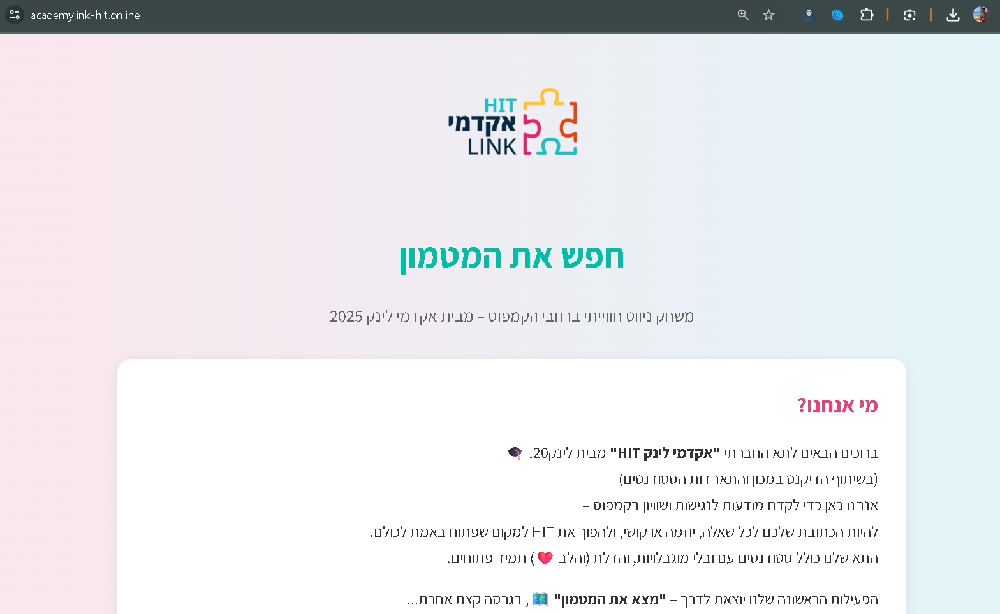

# AcademyLink

**AcademyLink** is an accessibility and inclusion initiative developed at the **Holon Institute of Technology (HIT)** in collaboration with **Link20** and the **HIT Student Union**.  
It aims to make campuses more **inclusive, navigable, and accessible** for students with disabilities through awareness, technology, and interaction.

This website was created to promote the rights and accessibility of differently-abled people by offering a **treasure-hunt experience** across campus!

---

## Aim
To bridge the gap between accessibility and everyday campus life. Empowering all students to participate equally, navigate campus easily, and raise awareness of accessibility challenges.

---

## Overview
Students can scan strategically placed **QR codes** around campus to:
- Learn about accessibility features and challenges  
- Watch short awareness videos  
- Participate in interactive puzzles and activities  
- Share accessibility feedback directly  

---

